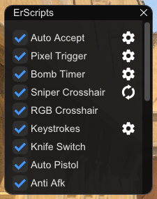
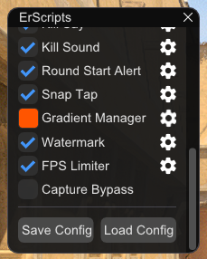
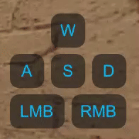
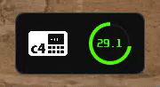

# ErScripts 🎮  
### Elevate Your *Counter-Strike 2* Experience  

**ErScripts** is a lightweight, multi-feature tool designed to enhance your *Counter-Strike 2 (CS2)* gameplay. Designed to run outside the game, it steers clear of memory injection or game tampering (no reading or writing memory), making it **completely safe** for Valve servers like Premier and Matchmaking.

---

## ✨ What is ErScripts?

**ErScripts** supercharges your CS2 experience with a sleek overlay, real-time game data, and smart automation. It taps into what the game provides, retrieving data through:

- **External Overlay**: Tracks CS2’s window position and size.
- **Config & Binds**: Sends commands via `exec` binds (e.g., `bind "KEY" "exec erscripts"`).
- **Game State Integration (GSI)**: Pulls live data like weapons and bomb status.
- **Console Logs**: Reads `console.log` for game insights.

No hacks, no bans—just pure, clean enhancement.

---

## 🚀 Features

Here’s what ErScripts brings to your arsenal:

| Feature               | Description                                                                 |
|-----------------------|-----------------------------------------------------------------------------|
| **Auto Accept**       | Automatically clicks "Accept" when a match is found.                        |
| ~~**Pixel Trigger**~~ | ~~Fires when the center-screen color changes (e.g., spotting enemies).~~    |
| **Sniper Crosshair**  | Custom crosshair overlay for snipers, synced with your crosshair settings.  |
| **Bomb Timer**        | Real-time bomb countdown with defuse kit alerts.                            |
| **RGB Crosshair**     | Adds a smooth gradient effect to your crosshair.                            |
| **Knife Switch**      | Switches knife hand based on your weapon.                                   |
| **Auto Pistol**       | Transforms pistols into rapid-fire beasts.                                  |
| **Anti AFK**          | Keeps you in-game by preventing AFK kicks.                                  |
| **Keystrokes**        | Displays WASD and mouse inputs on-screen.                                   |
| **Long Jump**         | Combines duck + jump for longer leaps.                                      |
| **Jump Throw**        | Combines jumps and throws for convenience.                                  |
| **Drop Bomb**         | Drops the bomb instantly and switches back.                                 |
| **Kill Say**          | Sends a message after each kill.                                            |
| **Kill Sound**        | Plays a sound after each kill.                                              |
| **Round Start Alert** | When you're not in the game and a new round starts, a sound plays.          |
| **Snap Tap**          | Instantly press the opposite key for a faster stop.                         |
| **Watermark**         | Shows ping, time, and game info.                                            |
| **Capture Bypass**    | Keeps the overlay hidden from recordings/streams.                           |
| **FPS Limiter**       | Limits overlay FPS for smoother performance.                                |

---

## 🛠️ Installation

Get started in just a few steps:

1. **Download**: Grab the latest release from [GitHub Releases](https://github.com/emp0ry/ErScripts/releases).
2. **Extract**: Unzip the files to any folder.
3. **Set Launch Options**: In Steam, add these `-conclearlog -condebug +bind scancode104 exec erscripts1` to CS2’s launch parameters:
4. **First Run**: Launch `ErScripts.exe` *before opening CS2* (afterward, you can launch it with CS2 running).
5. **Play**: Open CS2, tweak settings in the ErScripts menu, and dominate! 😎
6. **Exiting ErScripts**: To close the program, either click the "X" button in the ErScripts menu or press the "End" key on your keyboard.

---

## ⚙️ Configuration

Customize ErScripts to fit your playstyle:

### Pixel Trigger
- **Displacement**: X/Y offset from screen center (avoids crosshair overlap).
- **Threshold**: Color change sensitivity.
- **Delay**: Time before firing.

### Auto Accept
- **Waiting Time**: Set a timer in seconds for the time it takes to search for the "Accept" button.

### Bomb Timer
- **Scale**: Timer size.
- **Gradient**: Toggle gradient bomb icon.
- **Transparency**: Background opacity.

### Sniper Crosshair
- **Reload Icon**: Syncs with your in-game crosshair settings.

### Keystrokes
- **Scale**: Display size.
- **Gradient**: Toggle gradient text.
- **Animation Speed**: Keypress animation speed.
- **Colors**: Set pressed/released colors.
- **Transparency**: Opacity after released.

### Kill Sound, Round Start Alert
- **Volume**: Сhange sound volume.
- **File Name**: Specify the WAV file for the custom sound.
  - Leave empty to use the default sound.
  - Enter a custom WAV file (e.g., `sound.wav`) located in the executable’s folder.
  - You can write without specifying `.wav` (e.g., if it’s `sound.wav`, just write `sound`).
  - You can use a subfolder like `sounds` (e.g., `sounds/audio.wav` or `sounds/audio`).
  - If the file is missing or invalid, it defaults to the built-in sound.

### Watermark
- **Gradient**: Toggle gradient text.
- **Transparency**: Background opacity.
- **Ping Update Rate**: How often the in-game ping refreshes.

### Gradient Manager (RGB Effects)
- **Steps**: Smoothness of color transitions.
- **Delay**: Speed of color shifts.
- **Start/End Hue**: Pick your color range.
- **Saturation**: Color intensity (0 = gray, 1 = vibrant).
- **Value**: Brightness (0 = dark, 1 = bright).

*Other features (e.g., Knife Switch, Jump Throw, FPS Limiter) are easy to configure—no details needed here!*

---

## 🧠 How It Works

ErScripts is clever but safe:

- **Auto Accept**: Reads `console.log` for match detection, then clicks Accept button.
- **Pixel Trigger**: Monitors center-screen pixels for color shifts, triggering shots.
- **Sniper Crosshair**: Pulls active weapon data from GSI to detect sniper rifles, then mirrors your crosshair by sending commands through a config and reading data from `console.log`.
- **Bomb Timer**: Tracks bomb state via GSI, changes color for defuse urgency.
- **RGB Crosshair**: Cycles colors with console commands.
- **Knife Switch**: Toggles hands with `switchhands` via configs.
- **Auto Pistol**: Spams `attack` commands for rapid fire.

Everything runs externally—no game memory touched, no risks taken.

---

## 🖼️ Images

### Menu
|  |  |
|-----------------------------|-----------------------------|

### Keystrokes, Crosshair, Bomb Timer
|  |     |
|---------------------------------------|-------------------------------------------------------------------------------|

---

## 🛡️ Built With

ErScripts relies on these awesome libraries:
- **[Dear ImGui](https://github.com/ocornut/imgui)**: Slick overlay and UI.
- **[nlohmann/json](https://github.com/nlohmann/json)**: GSI and config parsing.
- **[cpp-httplib](https://github.com/yhirose/cpp-httplib)**: GSI data handling.
- **Windows API**: Registry access, window tracking, and inputs.
- **Standard C++**: Core logic and file management.

---

## 💖 Support the Project

Love ErScripts? Fuel its development with a coffee!

---

## 📜 License

Released under the [MIT License](LICENSE.txt). Free to use, modify, and share—just include the original license and copyright notice. A link to the original project for credit is appreciated!

---

## 🌟 Get Involved

Found a bug? Got a feature idea?  
- Open an [Issue](https://github.com/emp0ry/ErScripts/issues) or submit a [Pull Request](https://github.com/emp0ry/ErScripts/pulls).  
- Join the community and let’s make CS2 even better together!

---

Created with ❤️ by [emp0ry](https://github.com/emp0ry)