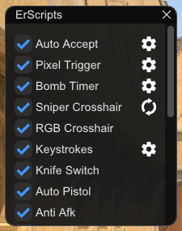
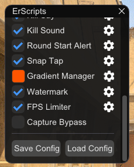
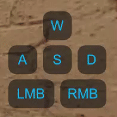
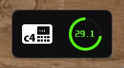

# ErScripts 🎮

### Enhance Your *Counter-Strike 2* Experience

**ErScripts** is a lightweight, open-source tool crafted for *Counter-Strike 2 (CS2)* fans to personalize and streamline their gameplay. It operates externally, never modifying game memory or files, using only what CS2 provides through console commands, Game State Integration (GSI), and log files.

---

## ⚠️ Disclaimer

**ErScripts** is a personal project by an independent developer, not affiliated with or endorsed by Valve Corporation, the creators of CS2. It offers features like *Auto Accept*, *Jump Throw*, and *Bomb Timer* to enhance convenience and fun. However:

- **Valve's Rules**: Some features automate actions via external inputs or scripts. Valve discourages automation in competitive play, and while *ErScripts* avoids game memory manipulation (no VAC violations), **use in official matchmaking may still risk account bans** at Valve's discretion.
- **User Responsibility**: You are solely responsible for complying with [Valve's Terms of Service](https://store.steampowered.com/subscriber_agreement/) and [CS2 Rules](https://www.counter-strike.net/). The developer is not liable for bans, data issues, or loss of functionality.
- **Intended Use**: This tool is for personal enjoyment, experimentation, and learning, not for gaining unfair advantages. Use it responsibly in appropriate settings (e.g., private servers or casual play) to respect the CS2 community.

---

## ✨ What is ErScripts?

**ErScripts** is a utility that adds convenience and flair to CS2 through an external overlay and automation features. It leverages:

- **External Overlay**: Tracks CS2's window for visual enhancements.
- **Config & Binds**: Executes commands via CS2's built-in `exec` system (e.g., `bind "KEY" "exec erscripts"`).
- **Game State Integration (GSI)**: Reads live game data like weapon status or bomb timers.
- **Console Logs**: Parses `console.log` for events like match acceptance.

No game files are altered beyond user-created configs, and no hacks are involved, just clean, creative tools for CS2 enthusiasts.

---

## 🚀 Features

Here's what *ErScripts* offers:

| Feature                  | Description                                                                 |
|--------------------------|-----------------------------------------------------------------------------|
| **Auto Accept**          | Clicks "Accept" when a match is found via `console.log` monitoring.         |
| ~~**Pixel Trigger**~~    | ~~Disabled feature (previously fired on color changes).~~                   |
| **Bomb Timer**           | Shows a real-time bomb countdown with defuse kit alerts via GSI.            |
| **Sniper Crosshair**     | Overlays a custom crosshair for snipers, synced with in-game settings.      |
| **Recoil Crosshair**     | Enable recoil crosshair with a static center crosshair.                     |
| **RGB Crosshair**        | Adds a gradient effect to your crosshair using console commands.            |
| **Keystrokes**           | Displays WASD and mouse inputs on-screen for streams or fun.                |
| **Knife Switch**         | Switches knife hand based on your weapon via `switchhands`.                 |
| **Auto Pistol**          | Rapid-fires pistols by repeating `attack` commands.                         |
| **Anti AFK**             | Prevents AFK kicks with subtle inputs.                                      |
| **Long Jump**            | Combines duck + jump for longer leaps with one keypress.                    |
| **Jump Throw**           | Simplifies jump-throw combos for consistent utility tosses.                 |
| **Drop Bomb**            | Drops the bomb and switches back instantly.                                 |
| **Kill Say**             | Sends a custom chat message after kills.                                    |
| **Kill Sound**           | Plays a sound on kills for extra flair.                                     |
| **Round Start Alert**    | Sounds an alert if a round begins while you're tabbed out.                  |
| **Auto Stop**            | Press the opposite key for an auto stop.                                    |
| **Chat Spammer**         | Automatically send repeated messages in chat.                              |
| **Angle Bind**           | Bind to offset yaw (horizontal view) angle.                                 |
| **Watermark**            | Shows ping, time, and game info as an overlay.                              |
| **FPS Limiter**          | Caps overlay FPS for smoother performance.                                  |
| **Capture Bypass**       | Hides the overlay from recordings/streams.                                  |

---

## 🛠️ Installation

Get started easily:

1. **Download**: Grab the latest release from [GitHub Releases](https://github.com/emp0ry/cs2-ErScripts/releases).
2. **Set Launch Options**: In Steam, add `-conclearlog -condebug +bind scancode104 exec erscripts1` to CS2's launch options.
3. **First Run**: Launch `ErScripts.exe` *before* CS2 (afterward, it's fine to start with CS2 running).
4. **Play**: Open CS2, configure settings in the ErScripts menu (*press Insert to show/hide the menu*), and enjoy!
5. **Exit**: Close via the "X" button in the menu or press the "End" key.
6. **Fullscreen Mode**: To play in fullscreen mode, right-click `cs2.exe`, go to **Properties → Compatibility**, and **uncheck** the *Disable fullscreen optimizations*.

You can change the key bindings for opening the menu and exiting the program in **Menu → Custom Binds**.

---

## ⚙️ Configuration

Tailor *ErScripts* to your liking:

### Auto Accept
- **Waiting Time**: Delay (in seconds) before searching for the "Accept" button.

### Bomb Timer
- **Scale**: Adjust timer size.
- **Gradient**: Enable/disable gradient icon.
- **Transparency**: Set background opacity.

### Sniper Crosshair
- **Reload Icon**: Syncs with your in-game crosshair settings.

### Keystrokes
- **Scale**: Size of the display.
- **Gradient**: Toggle gradient text.
- **Animation Speed**: Speed of keypress animations.
- **Colors**: Customize pressed/released colors.
- **Transparency**: Opacity when keys are released.

### Kill Sound, Round Start Alert
- **Volume**: Adjust sound loudness.
- **File Name**: Specify the WAV file for the custom sound.
  - Leave empty to use the default sound.
  - Enter a custom WAV file (e.g., `sound.wav`) located in the executable's folder.
  - You can write without specifying `.wav` (e.g., if it's `sound.wav`, just write `sound`).
  - You can use a subfolder like `sounds` (e.g., `sounds/audio.wav` or `sounds/audio`).
  - If the file is missing or invalid, it defaults to the built-in sound.

### Auto Stop
- **Toggle**: Enables hotkey to toggle auto-stop on/off (true) or activates it only while held (false).

### Chat Spammer
- **Chat Message**: Message to be repeatedly sent in chat.
- **Hotkey**: Bind to toggle chat spammer on/off. If set to `None`, the chat spammer will run without a hotkey.

### Angle Bind
- **Hotkey**: Bind to offset the player yaw (horizontal view) angle.
- **Degree**: The amount of yaw offset, from -180° to 180°.

### Watermark
- **Gradient**: Toggle gradient text.
- **Transparency**: Background opacity.
- **Ping Update Rate**: Refresh frequency for ping display.

### Gradient Manager (RGB Effects)
- **Steps**: Smoothness of color transitions.
- **Delay**: Speed of color shifts.
- **Start/End Hue**: Choose color range.
- **Saturation**: Color intensity (0 = gray, 1 = vibrant).
- **Value**: Brightness (0 = dark, 1 = bright).

*Other features (e.g., Knife Switch, Jump Throw, FPS Limiter) are easy to configure, no details needed here!*

---

## 🧠 How It Works

*ErScripts* enhances CS2 safely and externally by:

- **Command Sending**: Features like *Jump Throw*, *Drop Bomb*, and *Auto Pistol* work by writing CS2 commands (e.g., `+jump; -attack`) to numbered config files (e.g., `erscripts1.cfg`). These are triggered via pre-bound keys (e.g., `F13` to `F24`) simulated by *ErScripts*. In CS2, you bind a key to `exec erscripts1` (set via launch options), and *ErScripts* presses that key to run the command.
- **Auto Accept**: Monitors `console.log` for match detection, then simulates a mouse click on the "Accept" button.
- **Sniper Crosshair**: Reads active weapon data from GSI and overlays a custom crosshair synced with your settings.
- **Bomb Timer**: Tracks bomb state via GSI, updating the display with defuse urgency cues.
- **RGB Crosshair**: Cycles colors by sending console commands to adjust crosshair settings.
- **Knife Switch**: Uses `switchhands` via config files triggered by keybinds.

This method relies entirely on CS2's native systems, with no memory reading, writing, or injection, keeping it aligned with standard scripting practices while avoiding game file tampering.

---

## 🖼️ Images

### Menu
|  |  |
|-----------------------------|-----------------------------|

### Keystrokes, Crosshair, Bomb Timer
|  |     |
|---------------------------------------|-------------------------------------------------------------------------------|

---

## 🛡️ Built With

Powered by these amazing tools:

- **[Dear ImGui](https://github.com/ocornut/imgui)**: Overlay and UI framework.
- **[nlohmann/json](https://github.com/nlohmann/json)**: GSI and config parsing.
- **[cpp-httplib](https://github.com/yhirose/cpp-httplib)**: GSI data handling.
- **Windows API**: Window tracking and input simulation.
- **Standard C++**: Core functionality and file management.

---

## 💖 Support the Project

Love ErScripts? Fuel its development with a coffee!

---

## 📜 License

Released under the [MIT License](LICENSE.txt). Feel free to use, modify, and share, just keep the original license and credit [emp0ry](https://github.com/emp0ry).

---

## 🌟 Get Involved

Spotted a bug? Have a feature idea?

- File an [Issue](https://github.com/emp0ry/cs2-ErScripts/issues) or submit a [Pull Request](https://github.com/emp0ry/cs2-ErScripts/pulls).
- Join the community and let's elevate CS2 together!

---

Created with ❤️ by [emp0ry](https://github.com/emp0ry)
